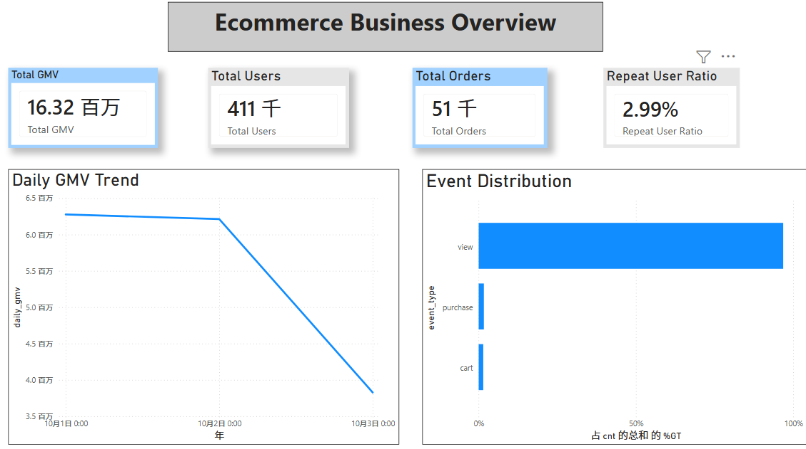
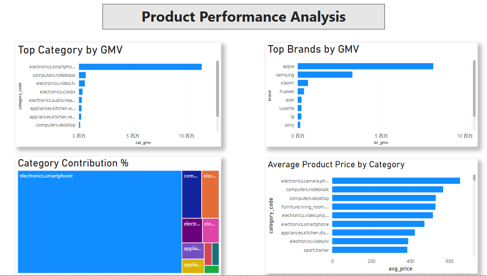
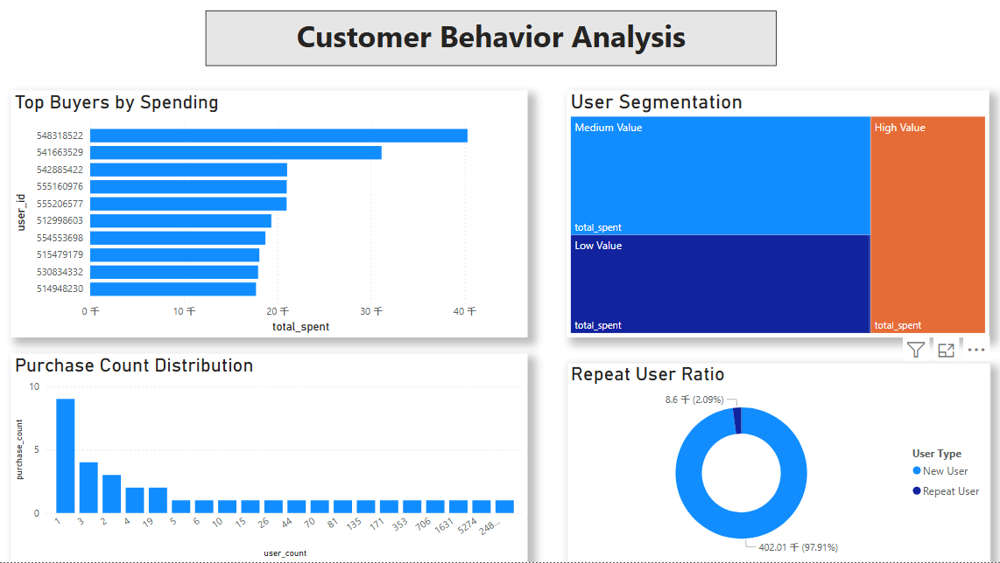
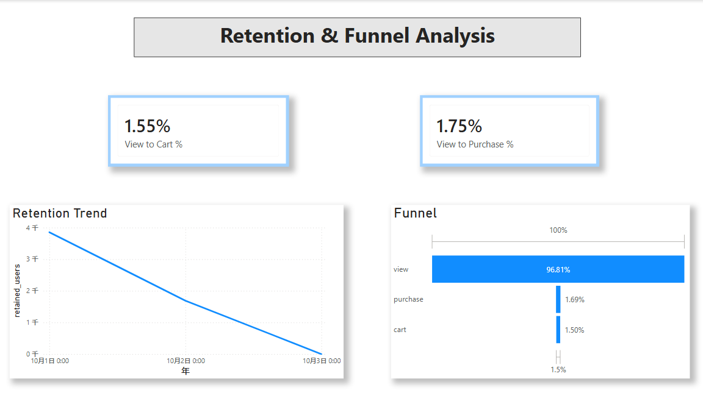
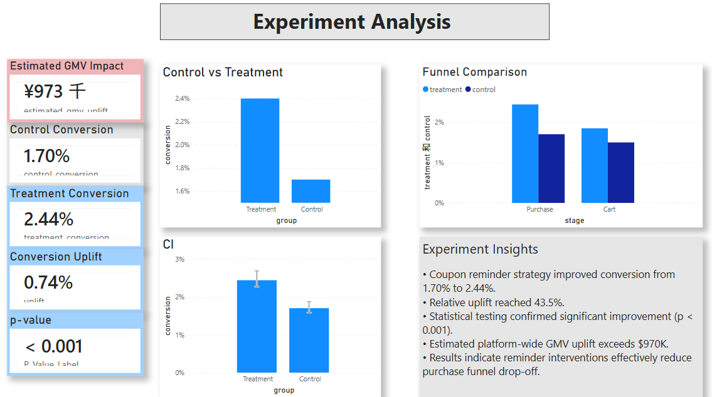

# E-Commerce Funnel Optimization & A/B Testing Analysis

This project focuses on identifying conversion bottlenecks in an e-commerce platform and evaluating intervention strategies through statistical experimentation.

The project covers the complete analytics workflow, including:

- SQL-based business analysis
- Funnel analysis
- User segmentation
- Retention analysis
- A/B testing simulation
- Statistical significance testing
- Power BI dashboard development

The objective is to improve purchase conversion and estimate potential GMV uplift through data-driven experimentation.

---

## 📌 1. Business Problem

Although the platform generated substantial traffic, overall purchase conversion remained relatively low.

Key findings:

- View events accounted for 96.81% of total activity
- Cart conversion rate was only 1.55%
- Purchase conversion rate was only 1.75%
- Repeat user ratio remained below 3%

These observations indicate significant friction in the purchase funnel and opportunities for conversion optimization.

---

## 🛠️ 2. SQL Business Analysis

SQL was used to build analytical datasets covering:

### Funnel Analysis

View → Cart → Purchase

### User Segmentation

Low Value / Medium Value / High Value

### Retention Analysis

Daily retention tracking

### Product Performance

Category GMV, Brand GMV, Average Selling Price

---

## 📊 3. Key Business Findings

### Funnel Drop-Off

Most users remain in the browsing stage.

Conversion sharply declines between:
View → Cart
Cart → Purchase


### User Structure

Medium-value and low-value users account for the majority of the user base.

High-value users contribute a disproportionate share of revenue.

### Product Concentration

Electronics dominate platform GMV.

Smartphones contribute more than 60% of category revenue.

### Retention Challenge

User retention declines continuously during the observed period.

Repeat users account for only 2.09%.

---

## 💡 4. Optimization Hypothesis

Based on funnel analysis, a coupon reminder strategy was proposed.

### Hypothesis

Sending targeted coupon reminders to users with purchase intent can increase purchase conversion.

Expected outcomes:

- Higher purchase rate
- Reduced funnel drop-off
- Increased platform GMV

---

## 🧪 5. A/B Testing Simulation

Users were randomly assigned into:

| Group | Description |
|-------|-------------|
| Control | No coupon reminder |
| Treatment | Coupon reminder intervention |

Python was used to simulate intervention outcomes and evaluate statistical significance.

### Experimental Results

| Metric | Control | Treatment | Absolute Uplift | Relative Uplift |
|--------|---------|-----------|----------------|----------------|
| Purchase Conversion | 1.70% | 2.44% | +0.74% | +43.5% |

---

## 📏 6. Statistical Validation

### Independent T-Test

P-Value < 0.001

The difference between Control and Treatment groups is statistically significant.

### 95% Confidence Interval

| Group     | 95% CI           |
|-----------|-----------------|
| Control   | 1.64% – 1.76%   |
| Treatment | 2.37% – 2.51%   |

The confidence intervals show a clear separation between groups, providing additional evidence that the intervention improves conversion performance.

---

## 💰 7. Estimated Business Impact

Assuming the strategy is deployed platform-wide:

- **Additional Buyers:** 3,041 users  
- **Estimated GMV Uplift:** $973K  

The analysis suggests that coupon reminders can generate meaningful incremental revenue while reducing purchase funnel drop-off.

---

## 📊 8. Power BI Dashboard

The project includes a five-page executive dashboard.

### Executive Overview

Overall platform performance, KPIs, and GMV trend.

### Product Performance Analysis

Category and brand contribution, average product pricing.

### Customer Behavior Analysis

Top buyers, purchase distribution, user segmentation.

### Retention & Funnel Analysis

Retention trend, conversion funnel.

### Experiment Analysis

A/B testing results, conversion uplift, confidence intervals, estimated GMV impact.

---

## 🎨 Dashboard Showcase

```markdown










```

---

## 📂 Repository Structure

sql/
    ecommerce_analysis.sql

notebooks/
    ecommerce_analysis.ipynb
    ab_test_real_users.ipynb

images/
    dashboard_overview.png
    product_analysis.png
    user_analysis.png
    retention_funnel.png
    experiment_analysis.png
